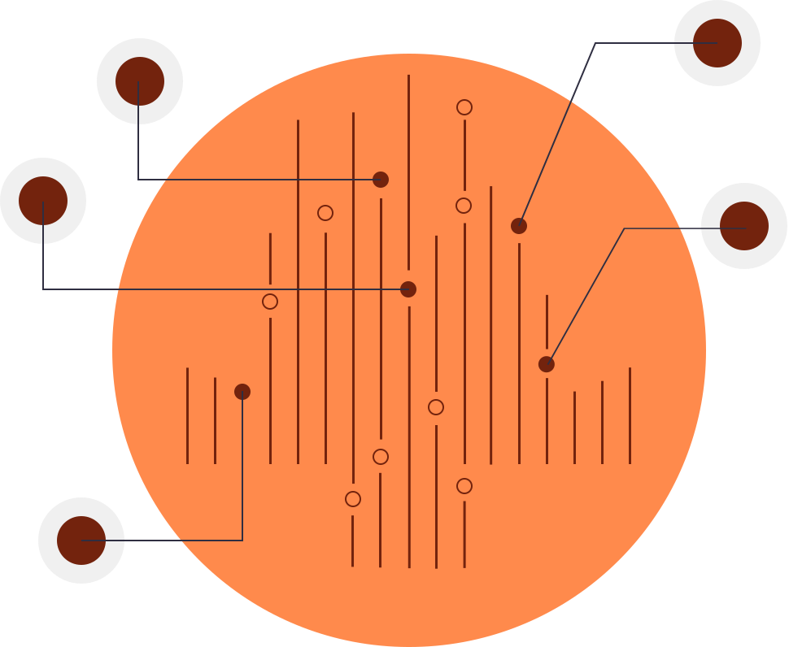
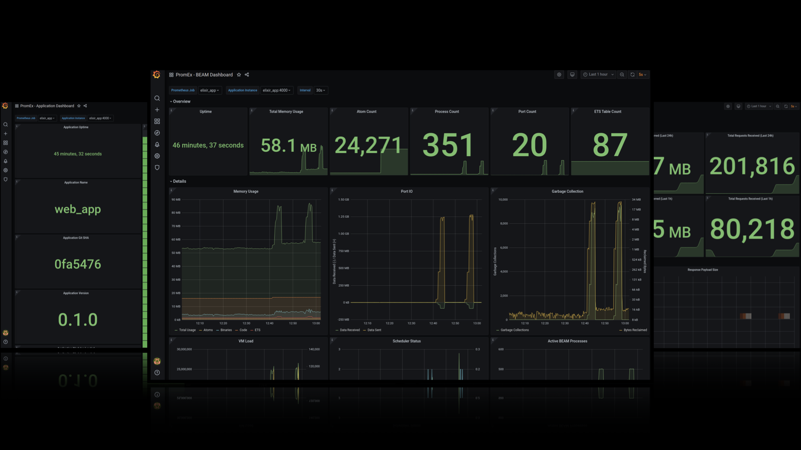
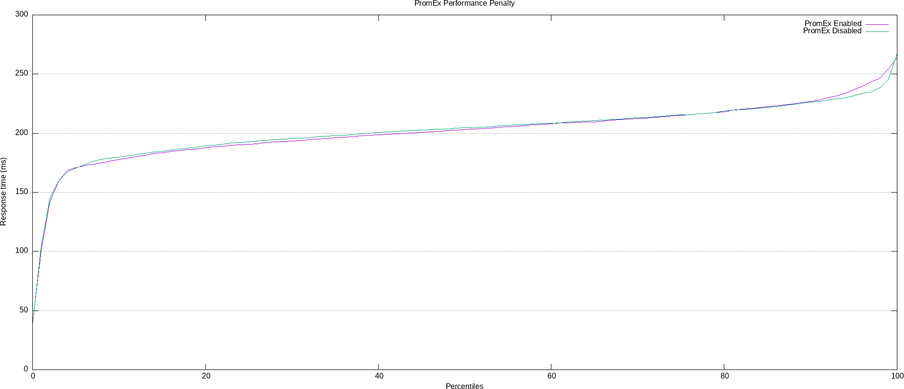

<!--START-->
<p align="center">
  
  
</p>

<p align="center">
  Prometheus metrics and Grafana dashboards for all of your favorite Elixir libraries
</p>

<p align="center">
  <a href="https://hex.pm/packages/prom_ex">
    
  </a>

  <a href="https://github.com/akoutmos/prom_ex/actions">
    
  </a>

  <a href="https://coveralls.io/github/akoutmos/prom_ex?branch=master">
    
  </a>

  <a href="https://elixir-lang.slack.com/archives/C01NZ0FBFSR">
    
  </a>

  <a href="https://github.com/sponsors/akoutmos">
    
  </a>
</p>

<br>
<!--END-->

# Contents

- [Installation](#installation)
- [Supporting PromEx](#supporting-promex)
- [Setting Up PromEx](#setting-up-promex)
- [Adding Your Metrics](#adding-your-metrics)
- [Design Philosophy](#design-philosophy)
- [Available Plugins](#available-plugins)
- [Grafana Dashboards](#grafana-dashboards)
- [Security Concerns](#security-concerns)
- [Performance Concerns](#performance-concerns)
- [Attribution](#attribution)

## Installation

[Available in Hex](https://hex.pm/packages/prom_ex), the package can be installed by adding `prom_ex` to your list of
dependencies in `mix.exs`:

```elixir
def deps do
  [
    {:prom_ex, "~> 1.7.1"}
  ]
end
```

Documentation can be found at [https://hexdocs.pm/prom_ex](https://hexdocs.pm/prom_ex).

## Supporting PromEx

PromEx has an ambition goal: To provide Prometheus metrics and Grafana dashboards for as many of the libraries in the Elixir ecosystem as possible as well as a framework so that you can manage the lifecycle of your own metrics and dashboards.

If you rely on PromEx to monitor your production applications, it would much appreciated if you can give back to the
project in order to help ensure its continued development.

### Gold Sponsors

<a href="https://github.com/sponsors/akoutmos/sponsorships?sponsor=akoutmos&tier_id=58083">
  
</a>

### Silver Sponsors

<a href="https://github.com/sponsors/akoutmos/sponsorships?sponsor=akoutmos&tier_id=58082">
  
</a>

### Bronze Sponsors

<a href="https://smartlogic.io/" style="margin-right: 10px;" target="_blank">
  
</a>

<a href="https://github.com/sponsors/akoutmos/sponsorships?sponsor=akoutmos&tier_id=17615">
  
</a>

## Setting Up PromEx

The goal of PromEx is to have metrics set up be as simple and streamlined as possible. In that spirit, all
that you need to do to start leveraging PromEx along with the built-in plugins is to run the following mix
task (the `YOUR_PROMETHEUS_DATASOURCE_ID` value should align with what is configured in Grafana as the name of the
Prometheus data source):

```
$ mix prom_ex.gen.config --datasource YOUR_PROMETHEUS_DATASOURCE_ID
```

Then add the generated module to your `application.ex` file supervision tree (be sure to add it to the top of the
supervisor children list so that you do not miss any init-style events from other processes like Ecto.Repo for
example):

```elixir
defmodule MyCoolApp.Application do
  use Application

  def start(_type, _args) do
    children = [
      MyCoolApp.PromEx,

      ...
    ]

    opts = [strategy: :one_for_one, name: MyCoolApp.Supervisor]
    Supervisor.start_link(children, opts)
  end
end
```

With that in place, all that you need to do is then add the PromEx plug somewhere in your
`endpoint.ex` file (I would suggest putting it before your `plug Plug.Telemetry` call so that
you do not pollute your logs with calls to `/metrics`):

```elixir
defmodule MyCoolAppWeb.Endpoint do
  use Phoenix.Endpoint, otp_app: :my_cool_app

  ...

  plug PromEx.Plug, prom_ex_module: MyCoolApp.PromEx
  # Or plug PromEx.plug, path: "/some/other/metrics/path", prom_ex_module: MyCoolApp.PromEx

  ...

  plug Plug.RequestId
  plug Plug.Telemetry, event_prefix: [:phoenix, :endpoint]

  ...

  plug MyCoolAppWeb.Router
end
```

With that in place, all you need to do is start your server and you should be able to hit your
metrics endpoint and see your application metrics:

```terminal
$ curl localhost:4000/metrics
# HELP my_cool_app_application_dependency_info Information regarding the application's dependencies.
# TYPE my_cool_app_application_dependency_info gauge
my_cool_app_application_dependency_info{modules="69",name="hex",version="0.20.5"} 1
my_cool_app_application_dependency_info{modules="1",name="connection",version="1.0.4"} 1
my_cool_app_application_dependency_info{modules="4",name="telemetry_poller",version="0.5.1"} 1
...
```

Be sure to check out the module docs for each plugin that you choose to use to ensure that you are familiar
with all of the options that they provide.

## Adding Your Metrics

While PromEx provides plugins for a lot of the popular community libraries, you can also leverage it to collect
metrics specific to your application. Similarly to how you use the PromEx Ecto plugin to collect metrics
relevant to Ecto, you can write your own plugin to collect metrics specific to your application. In fact, the same
tools that PromEx uses for its plugins are what you should use to create your own application specific plugins.

To write your own PromEx plugin, create a module that implements the `PromEx.Plugin` behaviour and collect the
relevant event/polling/manual metrics. Be sure to check out the 1st party PromEx plugins as a reference for how
plugins are written and how to collect the different types of data points (also checkout the [Writing PromEx Plugins
](https://hexdocs.pm/prom_ex/writing-promex-plugins.html) guide).

As a side note, PromEx will attach its own Telemetry handlers to events in order to capture Prometheus compatible
metrics and so any data points that are added to your `telemetry.ex` file (if you are using LiveDashboard) will
not show up in PromEx. One of the benefits of the Telemetry library is that you can have an arbitrary number of
event handlers attached to Telemetry events and so LiveDashboard and PromEx can operate in the same application
without any issues.

## Design Philosophy

With the widespread adoption of the Telemetry library and the other libraries in the [BEAM Telemetry GitHub
Org](https://github.com/beam-telemetry), we have reached a point in the Elixir ecosystem where we have a consistent
means of surfacing application and library metrics. This allows us to have a great level of insight into our
applications and dependencies given that they all leverage the same fundamental tooling. The goal of this project is to
provide a "Plug-in" style library where you can easily add new plug-ins to surface metrics so that Prometheus can scrape
them. Ideally, this project acts as the "Metrics" pillar in your application (in reference to [The Three Pillars of
Observability](https://www.oreilly.com/library/view/distributed-systems-observability/9781492033431/ch04.html)).

To this end, while PromEx does provide a certain level of configurability (like the polling rate, starting behaviour for
manual metrics and all the options that the plugins receive), the goal is not to make an infinitely configurable tool.
For example, you are not able to edit the names/descriptions of Prometheus metrics via plugin options or even the tags
that are attached to the data points.

Instead, if there things that you don't agree with or that are incompatible with your usage of a certain 1st party
plugin and want to edit how the PromEx plugins react to Telemetry events, it is recommended that you fork the plugin in
question and edit it to your specific use case. If you think that the community can benefit for your changes, do not
hesitate to make a PR and I'll be sure to review it. This is not to say that event configurability will never come to
PromEx, but I want to make sure that the public facing API is clean and straightforward and not bogged down with too
much configuration. In addition, the Grafana dashboards would then have to have a lot of templatized logic to
accommodate all this configurability (something which has been a pain-point in the Helm community for example).

PromEx provides the following utilities to you in order to achieve your observability goals:

- The `PromEx.Plug` module that can be used in your Phoenix or Plug application to expose the collected metrics
- A standalone HTTP metrics server if Phoenix is not a dependency in your project
- A Mix task to upload the provided complimentary Grafana dashboards
- A Mix task to create a PromEx metrics capture module
- A behaviour that defines the contract for PromEx plug-ins
- A behaviour that defines the functionality of a PromEx metrics capture module
- Grafana dashboards tailored to each specific Plugin so that metrics work out of the box with dashboards
- Grafana API support to create/upload to dashboard folders and to create graph annotations to mark events in Grafana
- EEx Grafana dashboard templates so you can dynamically tweak dashboards prior to uploading

## Available Plugins

| Plugin                           | Status      | Description                                                            |
| -------------------------------- | ----------- | ---------------------------------------------------------------------- |
| `PromEx.Plugins.Application`     | Stable      | Collect metrics on your application dependencies                       |
| `PromEx.Plugins.Beam`            | Stable      | Collect metrics regarding the BEAM virtual machine                     |
| `PromEx.Plugins.Phoenix`         | Stable      | Collect request metrics emitted by Phoenix                             |
| `PromEx.Plugins.Ecto`            | Stable      | Collect query metrics emitted by Ecto                                  |
| `PromEx.Plugins.Oban`            | Stable      | Collect queue processing metrics emitted by Oban                       |
| `PromEx.Plugins.PhoenixLiveView` | Stable      | Collect metrics emitted by Phoenix LiveView                            |
| `PromEx.Plugins.Absinthe`        | Stable      | Collect GraphQL metrics emitted by Absinthe                            |
| `PromEx.Plugins.PlugCowboy`      | Stable      | Collect HTTP request metrics emitted by Plug.Cowboy                    |
| `PromEx.Plugins.PlugRouter`      | Stable      | Collect HTTP request metrics emitted by Plug.Router and Plug.Telemetry |
| `PromEx.Plugins.Broadway`        | Beta        | Collect message processing metrics emitted by Broadway                 |
| `PromEx.Plugins.Finch`           | Coming soon | Collect HTTP request metrics emitted by Finch                          |
| `PromEx.Plugins.Redix`           | Coming soon | Collect Redis request metrics emitted by Redix                         |
| More to come...                  |             |                                                                        |

## Grafana Dashboards



Each PromEx plugin comes with a custom tailored Grafana Dashboard. [Click here](https://hexdocs.pm/prom_ex/all.html)
to check out sample screenshots of each Plugin specific Grafana Dashboard.

## Security Concerns

By default, you can set up a Prometheus scrape target without providing any security authorization configuration. As a
result, PromEx does not enforce any security precautions by default, and it is up to you to secure your `/metrics`
endpoint to ensure that people are not seeing sensitive information (sort of like Phoenix LiveDashboard where you need
to set up your own basic authentication plug to guard access).

There are a couple of solutions to this problem:

1. If your application is behind a load balancer or an API gateway, you can block access for any external requests to
   `/metrics` (or whatever route you chose to expose metrics over).

2. If your application is public facing, you can leverage the [Unplug](https://hex.pm/packages/unplug) library that I
   maintain in order to only execute the `PromEx.Plug` plug when the incoming request fulfills your configured
   requirements (see the [PromEx.Plug HexDocs](https://hexdocs.pm/prom_ex/1.1.1/PromEx.Plug.html) for an example).

## Performance Concerns

You may think to yourself that with all these metrics being collected and scraped, that the performance of your
application may be negatively impacted. Luckily PromEx is built upon the solid foundation established by the `Telemetry`,
`TelemetryMetrics`, and the `TelemetryMetricsPrometheus` projects. These libraries were designed to be as lightweight
and performant as possible. From some basic stress tests that I have run, I have been unable to observe any meaningful
performance reduction (thank you OTP and particularly ETS ;)). Below are the results from a recent stress test using
ApacheBench:

### With PromEx metrics collection

```terminal
$ ./benchmarks/ab-graph.sh -u http://localhost:4000 -n 1000 -c 50 -k
Server Software:        Cowboy
Server Hostname:        localhost
Server Port:            4000

Document Path:          /
Document Length:        3389 bytes

Concurrency Level:      50
Time taken for tests:   4.144 seconds
Complete requests:      1000
Failed requests:        0
Keep-Alive requests:    1000
Total transferred:      4060000 bytes
HTML transferred:       3389000 bytes
Requests per second:    241.32 [#/sec] (mean)
Time per request:       207.191 [ms] (mean)
Time per request:       4.144 [ms] (mean, across all concurrent requests)
Transfer rate:          956.81 [Kbytes/sec] received

Connection Times (ms)
              min  mean[+/-sd] median   max
Connect:        0    0   0.2      0       1
Processing:    39  202  24.3    203     264
Waiting:       38  202  24.3    203     264
Total:         39  202  24.2    203     264

Percentage of the requests served within a certain time (ms)
  50%    203
  66%    210
  75%    215
  80%    218
  90%    227
  95%    237
  98%    246
  99%    255
 100%    264 (longest request)
```

### Without PromEx metrics collection

```terminal
$ ./benchmarks/ab-graph.sh -u http://localhost:4000 -n 1000 -c 50 -k
Server Software:        Cowboy
Server Hostname:        localhost
Server Port:            4000

Document Path:          /
Document Length:        3389 bytes

Concurrency Level:      50
Time taken for tests:   4.156 seconds
Complete requests:      1000
Failed requests:        0
Keep-Alive requests:    1000
Total transferred:      4060000 bytes
HTML transferred:       3389000 bytes
Requests per second:    240.59 [#/sec] (mean)
Time per request:       207.822 [ms] (mean)
Time per request:       4.156 [ms] (mean, across all concurrent requests)
Transfer rate:          953.90 [Kbytes/sec] received

Connection Times (ms)
              min  mean[+/-sd] median   max
Connect:        0    0   0.1      0       1
Processing:    38  202  23.1    205     267
Waiting:       37  202  23.1    205     267
Total:         38  202  23.0    205     267

Percentage of the requests served within a certain time (ms)
  50%    205
  66%    211
  75%    215
  80%    219
  90%    226
  95%    232
  98%    238
  99%    246
 100%    267 (longest request)
```

### Plotting the stress test results

In the spirit of visualizing performance characteristics, the percentile data from the ApacheBench stress tests has been
overlaid and plotted using Gnuplot (thanks to
[apachebench-graphs](https://github.com/juanluisbaptiste/apachebench-graphs) for making Gnuplot-ing a lot more
streamlined :)). As we can see, the distributions track each other more or less 1:1 except for the slowest 5-10% of requests where
we see a slight performance hit. In other words, 90% of the time there was no measurable performance overhead in the
instrumented application.



## Attribution

It wouldn't be right to not include somewhere in this project a "thank you" to the various projects and people that
helped make this possible:

- The various projects available in [BEAM Telemetry](https://github.com/beam-telemetry)
- All of the Prometheus libraries that Ilya Khaprov ([@deadtrickster](https://github.com/deadtrickster)) maintains
- The logo for the project is an edited version of an SVG image from the [unDraw project](https://undraw.co/)
- Juan Luis Baptiste for the nifty ApacheBench+Gnuplot shell scripts [apachebench-graphs](https://github.com/juanluisbaptiste/apachebench-graphs)
